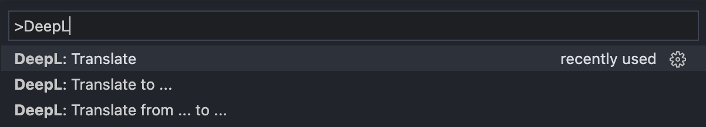
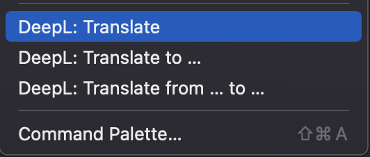

# vscode-deepl

Translate texts in more than 25 languages directly in your favourite code editor powered by [DeepL](https://www.deepl.com/translator).
This extension provides all the necessary integrations to easily translate texts without leaving your code editor.

## Features

The extension provides the following functionalities:

* Translate selected text in more than 25 languages and replaces them directly
* Automatically recognises the source language

The following commands are available to translate texts:

|Command|Keybinding|Description
|---|---|---
|DeepL: Translate|alt+t|Translates the selected text into the last used target language 
|DeepL: Translate to ...|alt+shift+t|Asks for the target language and translates the selected text into the target language
|DeepL: Translate from ... to ...|alt+ctrl+shift+t|Asks for source and target language and translates the selected text from the source language into the target language

The commands are accessible via the command pallette.

In addition, the context menu is extended and now includes the translation commands.

The currently selected target language is displayed in the status bar. By clicking the item you can change the target language.

## Requirements

In order to use this extension, you need a DeepL API key.
To get an API key, you need to create an account [here](https://www.deepl.com/pro).
After you have created an account, you will find your API key [here](https://www.deepl.com/pro-account/plan).
You can store the API key via the following settings.

## Extension Settings

This extension contributes the following settings:

* `deepl.apiKey`: The key is used to authenticate with the DeepL API. [See offical documentation](https://www.deepl.com/docs-api/accessing-the-api/authentication/)
* `deepl.usePro`: Whether to use the DeepL Pro API - check this option if you use the paid plan.
* `deepl.formality`: Whether the translated text should lean towards formal or informal language in certain languages.
* `deepl.splitSentences`: Sets whether the translation engine should first split the input into sentences.

For this extension to work, the above settings must be made.

## Disclaimer

This extension is not an official implementation of the DeepL API from DeepL itself!
The author has no connection to DeepL.

## Privacy Policy

The texts are translated via the online service of [DeepL](https://www.deepl.com). Please take a look at their [privacy policy](https://www.deepl.com/en/privacy/).  
Dont use this extension if you dont agree with their privacy policy!

## Release Notes

### 1.0.2

Added more settings to use more deepl api parameters

### 1.0.1

Added extension logo

### 1.0.0

Initial release of vscode-deepl

[MIT LICENSE](LICENSE)
